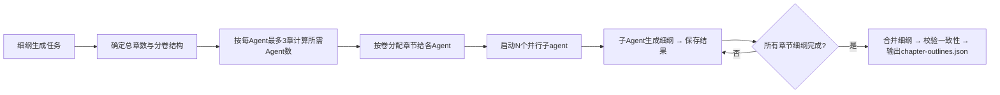

## 网文大纲设计

### 触发关键词
帮我写个小说大纲、设计主角人设、做世界观设定、搭小说剧情框架、写分卷细纲、给我设计小说人物、做个玄幻世界观、帮我梳理小说剧情、小说人物设定、写小说分章大纲、爽点排布规划、做小说人设卡、构建小说世界、小说大纲生成、写完整章节细纲、生成全本细纲、所有章节细纲

### 核心功能
1. 世界观设定：世界背景、力量体系、社会规则、地理设定
2. 人物设定：主角、配角、反派的人物画像、性格、成长线
3. 剧情框架：主线故事、支线剧情、关键节点、高潮安排
4. 分卷大纲：按卷划分剧情阶段，明确每卷核心冲突与目标
5. 爽点排布：规划关键爽点、转折点、悬念点的位置
6. 强制合规检查：基于AI推理检测所有名称，识别可能的真实人名/地名，避免侵权风险

### 输出结构

#### 一、世界观设定模板
- **世界背景**：
  - 时代背景（古代/现代/未来/玄幻）
  - 历史脉络（关键事件节点）
  - 世界本质（核心规则/底层逻辑）
  
- **力量体系**：
  - 力量等级划分（清晰的进阶路径）
  - 力量获取方式
  - 力量平衡机制（克制关系）
  
- **社会规则**：
  - 政治结构
  - 经济体系
  - 社会阶层
  - 文化习俗
  - 禁忌规则

- **地理设定**：
  - 世界地图概览
  - 关键地点（主城/秘境/险地）：**强制使用虚构名称**，禁止使用现实世界真实存在的国家、城市、山脉、河流、景点等名称
  - 区域特色与势力分布

#### 二、人物设定模板
- **主角设定卡**：
  - 基本信息：姓名、年龄、外貌、身份：**强制使用虚构姓名**，禁止使用现实世界真实存在的公众人物、历史人物、知名IP角色名称
  - 性格特点：核心性格、优缺点、口头禅
  - 背景故事：过往经历、创伤/执念、初始状态
  - 核心目标：短期/中期/长期目标
  - 成长弧光：从××到××的转变
  - 金手指/特殊能力：来源、限制、成长空间
  - 人物标签：3-5个关键标签（如"废柴逆袭"、"理智腹黑"）

- **主要配角设定卡**（3-5人）：
  - 与主角关系
  - 人物功能（导师/伙伴/对手/红颜）
  - 基本信息与性格
  - 个人目标与成长线
  - 与主角的互动模式

- **反派设定卡**（1-3人）：
  - 基本信息与性格
  - 反派动机（为什么做坏事）
  - 实力层次与势力
  - 与主角的核心冲突
  - 反派魅力点（避免扁平化）

#### 三、剧情大纲设计
- **主线故事线**：
  - 开篇（第1-3章）：切入点、初始状态、引出金手指/冲突
  - 发展期：逐步升级、势力扩张、感情升温
  - 高潮期：最终冲突、真相揭晓、命运抉择
  - 结局：收尾方式、各人物归宿、余韵

- **支线剧情**：
  - 配角个人线
  - 世界观探索线
  - 感情线
  - 伏笔回收线

#### 四、爽点排布公式
**黄金爽点密度**：每3-5章一个小爽点，每10-15章一个中爽点，每30-50章一个大高潮。

**爽点类型清单**：
1. 打脸爽：反派轻视→主角实力打脸
2. 收获爽：获得宝物/功法/突破
3. 身份爽：身份曝光/地位提升
4. 情感爽：感情升温/感情确定
5. 智力爽：布局成功/计谋得逞
6. 探索爽：发现秘境/解锁真相
7. 团战爽：团队配合/以弱胜强

**爽点节奏公式**：
```
铺垫(压抑期待) → 转折(意外出现) → 爆发(爽点释放) → 余韵(新的悬念)
```

#### 五、分卷规划方法
**经典分卷结构**（以100-200万字为例）：

| 卷数 | 字数范围 | 核心目标 | 冲突层级 | 结尾状态 |
|------|----------|----------|----------|----------|
| 第一卷 | 20-30万 | 立足篇 | 新手村/局部冲突 | 获得初步实力，离开新手村 |
| 第二卷 | 30-40万 | 崛起篇 | 区域/势力冲突 | 建立势力/扬名一方 |
| 第三卷 | 30-40万 | 风暴篇 | 全国/跨区域冲突 | 卷入更大阴谋，实力跃迁 |
| 第四卷 | 30-40万 | 真相篇 | 世界层级冲突 | 揭露真相，面临终极抉择 |
| 第五卷 | 20-30万 | 终章篇 | 终极冲突 | 解决一切，归宿与新篇 |

**每卷必备要素**：
- 卷名：有寓意的标题
- 核心冲突：本卷主要矛盾
- 升级节点：主角关键突破
- 重要转折：剧情转折点
- 卷末钩子：引导下一卷的悬念

#### 六、完整章节细纲

**细纲生成规则：**
- 根据总篇幅规划生成对应数量的章节细纲（短篇20-50章，中篇50-100章，长篇100-200章，超长篇200章以上）
- 每章细纲包含足够细节，支持独立生成完整章节内容
- 细纲按分卷组织，每卷有明确的卷目标和核心冲突

**每章细纲要素（必填）：**
- **章节编号**：第X章
- **章节标题**：吸引人的章节标题
- **章节字数建议**：推荐字数范围（如3000-4000字）
- **核心事件**：本章主要发生什么事（1-2句话概括）
- **出场人物**：本章出场的主要人物列表
- **剧情推进**：详细描述本章情节发展步骤（3-5个关键节点）
- **本章爽点/悬念**：本章的核心看点、爽点或结尾悬念
- **伏笔埋设**：本章埋设的伏笔（如有）
- **与前后章关联**：承接上章什么内容，引出下章什么内容
- **场景地点**：本章主要发生的场景
- **POV视角**：本章采用谁的视角（默认主角视角）
- **情绪基调**：本章的整体情绪氛围（紧张/轻松/热血/温情等）

**细纲输出格式：**
- 用户可见：`小说大纲_章节细纲.md`（Markdown格式，易读）
- 机器可读：`.sumeru/outline/chapter-outlines.json`（完整JSON结构，供后续skill使用）

### 子Agent并行细纲生成机制

当需要生成的章节细纲数量大于3章时（中篇及以上篇幅），支持使用子Agent并行生成细纲：

**⚠️ 遵循全局约束：每个子Agent最多负责3个章节的细纲生成**（详见 AGENTS.md "子Agent并行处理规则"）
- 所需Agent数 = ceil(总章节数 / 3)
- 分配策略：按卷分配优先，同一卷的章节尽量分配给同一组Agent
- 每个Agent接收：已确定的世界观设定、人物设定、分卷大纲、负责章节的上下文关联

**调度逻辑**


**一致性校验**
- 并行生成的细纲需要合并后进行一致性校验
- 检查相邻章节的情节衔接、人物出场连续性、时间线逻辑
- 检查跨卷伏笔的设置与回收规划

### 合规约束规则
为避免侵权和合规风险，大纲生成过程严格执行以下命名约束：
1. **人名约束**：
   - ❌ 禁止使用任何真实世界的人名，包括但不限于：历史人物、当代公众人物、明星、政治人物、知名IP角色名
   - ❌ 禁止使用现实中存在的姓氏+真实名字的组合
   - ✅ 鼓励使用原创虚构姓名，可使用谐音、改编、生僻字组合等方式创作
   - ✅ 架空历史类作品如需要映射真实人物，必须做足够的虚构化改编，不得直接使用原名

2. **地名约束**：
   - ❌ 禁止使用任何真实世界的地理名称，包括但不限于：国家名、城市名、省份名、山脉名、河流名、景点名、街道名
   - ❌ 禁止使用现实中存在的组织机构名称、学校名、公司名、政府部门名
   - ✅ 鼓励使用原创虚构地名，可根据地域特色、功能定位等创作有辨识度的名称
   - ✅ 现实背景类作品如需要映射真实地点，必须使用虚构化名称（如"魔都"、"帝都"等泛称，或谐音改编名称）

3. **自动检查机制**：
   - 大纲生成时基于AI推理识别可能的真实人名/地名
   - 发现疑似真实名称时自动提示并提供3个以上虚构替换方案
   - 所有违规名称必须替换后才能完成大纲生成
   - 合规检查报告自动保存到 `.sumeru/outline/compliance-check.json`

### 数据持久化
**用户可见输出（当前工作目录）**：
- `小说大纲_世界观设定.md`：完整世界观设定文档（直接可读）
- `小说大纲_剧情框架.md`：主线+支线剧情大纲+分卷规划（直接可读）
- `小说大纲_章节细纲.md`：完整的章节细纲（直接可读，包含所有章节）

**中间数据（仅系统内部使用，存于`.sumeru/outline/`目录）**：
- `world.json`：世界观设定（JSON格式，供后续 skill 复用）
- `characters.json`：结构化人物设定卡（JSON格式，供后续 skill 复用）
- `plot-outline.json`：剧情大纲数据（JSON格式，供后续 skill 复用）
- `chapter-outlines.json`：**完整章节细纲数据**（JSON格式，供 sumeru-write 并行生成章节使用）
- `world.md`：世界观设定备份
- `plot.md`：剧情大纲备份

#### chapter-outlines.json 数据结构规范

```json
{
  "meta": {
    "totalChapters": 100,
    "volumes": [
      {
        "volumeNumber": 1,
        "volumeName": "立足篇",
        "chapterStart": 1,
        "chapterEnd": 20,
        "coreConflict": "新手村冲突与立足"
      }
    ],
    "generatedAt": "2026-04-05T10:00:00Z"
  },
  "chapters": [
    {
      "chapterNumber": 1,
      "chapterTitle": "废柴少爷",
      "suggestedWords": "3000-4000",
      "coreEvent": "主角在家族中被轻视，觉醒金手指",
      "characters": ["主角", "反派少爷", "管家"],
      "plotProgression": [
        "开篇展示主角废柴处境",
        "反派上门挑衅",
        "主角意外觉醒金手指",
        "初步展现实力，震惊众人",
        "结尾埋下离开家族的伏笔"
      ],
      "coolPoint": "觉醒金手指的瞬间，初步打脸挑衅者",
      "suspense": "金手指的真正功能是什么？",
      "foreshadowing": "提到家族的神秘祖传物品",
      "connection": "承接：开篇；引出：下章测试金手指",
      "location": "家族演武场",
      "pov": "主角视角",
      "mood": "压抑→震惊→期待",
      "volumeNumber": 1
    }
  ]
}
```

#### world.json 数据结构规范

```json
{
  "meta": {
    "generatedAt": "2026-04-26T10:00:00Z",
    "genre": "玄幻",
    "style": "详细"
  },
  "background": {
    "era": "时代背景（古代/现代/未来/玄幻）",
    "history": ["关键历史事件1", "关键历史事件2"],
    "coreRules": "世界本质/底层逻辑"
  },
  "powerSystem": {
    "levels": ["等级1", "等级2", "等级3"],
    "acquisition": "力量获取方式",
    "balance": "力量平衡/克制关系"
  },
  "society": {
    "politics": "政治结构",
    "economy": "经济体系",
    "classes": ["社会阶层1", "社会阶层2"],
    "culture": ["文化习俗1", "文化习俗2"],
    "taboos": ["禁忌规则1", "禁忌规则2"]
  },
  "geography": {
    "overview": "世界地图概览",
    "locations": [
      {
        "name": "虚构地名",
        "type": "主城/秘境/险地",
        "description": "地点描述",
        "factions": ["关联势力"]
      }
    ]
  }
}
```

#### characters.json 数据结构规范

```json
{
  "meta": {
    "generatedAt": "2026-04-26T10:00:00Z",
    "totalCharacters": 8
  },
  "protagonist": {
    "name": "主角姓名（虚构）",
    "age": "年龄",
    "appearance": "外貌描述",
    "identity": "身份",
    "personality": {
      "core": ["核心性格1", "核心性格2"],
      "strengths": ["优点1", "优点2"],
      "weaknesses": ["缺点1", "缺点2"],
      "catchphrase": "口头禅"
    },
    "background": "过往经历",
    "trauma": "创伤/执念",
    "goals": {
      "shortTerm": "短期目标",
      "midTerm": "中期目标",
      "longTerm": "长期目标"
    },
    "growthArc": "从XX到XX的转变",
    "goldenFinger": {
      "name": "金手指名称",
      "source": "来源",
      "description": "描述",
      "limitations": ["限制1", "限制2"],
      "growthSpace": "成长空间"
    },
    "tags": ["标签1", "标签2", "标签3"]
  },
  "supportingCharacters": [
    {
      "name": "配角姓名（虚构）",
      "relationship": "与主角关系",
      "function": "导师/伙伴/对手/红颜",
      "personality": "性格描述",
      "goal": "个人目标",
      "growthLine": "成长线",
      "interactionMode": "与主角互动模式"
    }
  ],
  "antagonists": [
    {
      "name": "反派姓名（虚构）",
      "personality": "性格描述",
      "motivation": "反派动机",
      "power": "实力层次",
      "conflict": "与主角核心冲突",
      "charm": "反派魅力点"
    }
  ]
}
```

#### 与其他 Skill 配合
- **前置 Skill**：可读取 `sumeru-topic` 的 `options.json`（使用 `--load-from` 参数）
- **后续 Skill**：生成的数据可供 `sumeru-write`、`sumeru-review` 使用
  - `sumeru-write` 自动读取 `chapter-outlines.json`，支持**单章或批量并行生成**所有章节
  - `sumeru-review` 直接读取大纲数据校验剧情偏离度

### 内置参考资源库
outline技能内置多风格参考信息库，位于 `skills/outline/references/` 目录下，生成大纲时可自动引用匹配风格的参考内容：

| 参考文件 | 内容说明 | 适用风格 |
|---------|---------|----------|
| `xianhuan-style-reference.md` | 玄幻风格设定参考，包含境界体系、势力划分、虚构人名/地名/宝物库 | 玄幻、高武、异世界 |
| `xianxia-style-reference.md` | 仙侠风格设定参考，包含修仙境界、门派设定、洞府/秘境名称、修仙道具库 | 仙侠、修真、洪荒、封神 |
| `urban-style-reference.md` | 都市风格设定参考，包含虚构城市、公司/组织、职业设定、常见金手指 | 都市、现代、职场、商战 |
| `sci-fi-style-reference.md` | 科幻风格设定参考，包含星际设定、科技体系、势力划分、未来职业 | 科幻、星际、机甲、赛博朋克 |
| `romance-style-reference.md` | 言情风格设定参考，包含人物类型、常见场景、情节梗、言情专用人名库 | 言情、甜宠、虐恋、宫斗、宅斗 |
| `common-naming-library.md` | 通用命名库，包含数百个姓氏、男女常用字、地名常用字、势力命名模板 | 全风格通用 |
