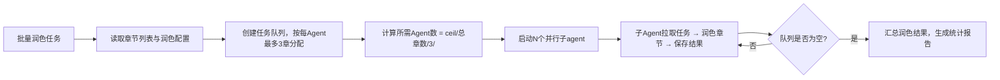

## 网文内容润色

### 触发关键词
帮我润色这段小说、改下文笔、优化章节节奏、强化这个爽点、让对话更自然、把这段写得更爽、优化小说文笔、调整章节节奏、让对话更真实、帮我改下这段内容、润色小说、优化爽点、提升文笔、让这段更有代入感、小说内容优化、文笔润色

### 核心功能

#### 润色等级
1. **轻度润色**：修正语病、标点、错别字，调整语序让语句通顺，保留90%以上原文风格和表达方式
2. **中度润色**：优化句式结构，去除冗余表述，精炼用词，提升文字流畅度，保留70%原文核心表达
3. **深度润色**：重构段落结构，优化叙事视角，全面提升文笔质感，保留50%原文情节框架
4. **精修润色**：逐字打磨，雕琢细节，追求最佳阅读体验，保留核心情节脉络

#### 风格适配选项
- **小白爽文**：短句为主，节奏明快，情绪直接，用词通俗易懂
- **精品文**：句式多变，文笔细腻，注重氛围营造，人物心理刻画深入
- **古风仙侠**：用词雅致，意境悠远，适当运用古典词汇和修辞手法
- **都市现实**：语言生活化，对话接地气，场景描写真实可感
- **悬疑推理**：语言凝练，节奏紧凑，信息密度适中，悬念感强
- **科幻未来**：科技感词汇准确，逻辑严密，世界观表述清晰

#### 针对性优化
1. **节奏收紧**
   - 删除无效铺垫：去除与主线无关的场景描写、心理活动
   - 压缩过渡情节：将冗长的转场、交代性文字缩短30%-50%
   - 加快信息传递：采用对话、行动展现信息，减少大段叙述
   - 调整段落长度：将超长段落拆分为2-3行的短段落，提升阅读速度

2. **爽点强化**
   - **前置铺垫**：在爽点前300-500字设置期待感，通过反派挑衅、主角困境、他人质疑等方式铺垫
   - **情绪递进**：爽点爆发分三层：期待→紧张→释放，每一层情绪都要有具体描写
   - **细节放大**：主角行动、他人反应、环境变化三个维度同时描写，增强画面感
   - **收尾有力**：爽点后用100-200字总结效果，或留下新的钩子
   - **经典结构**：[压抑/挑衅]→[蓄力/准备]→[爆发/打脸]→[余波/影响]

3. **对话优化**
   - **人设贴合**：每句对话符合人物年龄、身份、性格，避免千人一面
   - **潜台词**：重要对话包含言外之意，通过语气、动作辅助表达
   - **节奏控制**：长段对话拆分为多轮，穿插动作、表情、心理描写
   - **信息传递**：通过对话自然交代背景、推动情节，避免生硬说明
   - **口语化**：减少书面语，多用真实生活中的表达习惯，但避免语病
   - **对话标签优化**：用具体动作代替"说"、"道"，如"挑眉道"、"冷哼一声"

4. **文笔优化**
   - **精准用词**：替换重复词汇、模糊表达，选用更准确的动词、形容词
   - **句式变化**：长短句结合，避免清一色的主谓宾结构
   - **感官描写**：调动视觉、听觉、嗅觉、触觉、味觉，增强代入感
   - **比喻具象**：用读者熟悉的事物作比，避免抽象、生僻的比喻
   - **去除冗余**：删除"非常"、"十分"、"很"等副词，用动词和名词表达程度

### 输出内容
- 润色后的完整章节内容
- 润色修改说明：调整的地方与原因（按优化类型分类说明）
- 优化建议：后续内容写作提升方向，具体可操作的技巧

### 子Agent并行润色机制

当需要润色的章节数量大于3章时，自动启用子Agent并行润色模式：

**⚠️ 核心约束：每个子Agent最多负责3个章节**
- 无论总章节数多少，每个子Agent承担的章节数不能超过3章
- 这是为了保证每个章节的润色质量，避免单个Agent处理过多章节导致风格不统一和质量下降
- 章节分配示例：100章润色任务 → 至少需要 ceil(100/3)=34个子Agent并行处理

**调度逻辑**

**子Agent输入上下文**
每个子agent接收：
1. 润色等级与风格参数
2. 负责章节的原始内容
3. 世界观设定（精简版，保持术语一致）
4. 人物设定（仅相关人物，保持性格一致）
5. 审查问题清单（如有，作为重点优化方向）

**章节分配规则**
- 按章节顺序连续分配（如Agent1负责第1-3章，Agent2负责第4-6章）
- 相邻章节分配给同一Agent，保持风格连贯性
- 尾部不足3章的Agent按实际剩余章节数分配

**进度追踪**
- 每个Agent完成润色后立即将结果保存到 `.sumeru/polish/modified/`
- 实时显示已完成/进行中/待润色章节状态
- 所有Agent完成后，润色结果统一替换到 `chapters/` 目录

### 数据持久化
润色过程数据自动保存到 `.sumeru/polish/` 目录：
- `modified/`：润色后的章节内容，与原章节目录结构一致
- `diff/`：修改对比文件，记录每处修改的位置、原文、修改后内容、修改原因
- `summary.json`：润色统计报告，包含修改数量、优化类型分布、字数变化
- `style-config.json`：本次润色使用的风格、等级、重点参数配置

#### 与其他 Skill 配合
- **前置 Skill**：读取 `sumeru-write` 和 `sumeru-review` 的输出
  - 从 `chapters/` 读取原始章节内容
  - 从 `.sumeru/review/issues.json` 读取审查问题作为优化重点
- **后续 Skill**：润色后的内容供 `sumeru-finalize` 使用

#### 数据复用
- 支持多轮润色，可基于上一轮润色结果继续优化
- 可导出diff文件用于人工审核修改内容
- 风格配置可复用，保持全本润色风格统一
