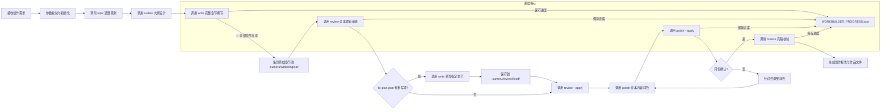

## 网文创作世界构建师 (worldbuilder)

### 触发关键词
我想写小说、写一本网文、从零开始创作小说、帮我写本XX类型的小说、我要写本小说、给我整个小说创作流程、自动写小说、小说创作一站式服务、帮我完成一本小说、我只有创意怎么写小说、从零开始写网文、小说全流程创作

### 核心功能
worldbuilder 是网文创作的一站式主控技能，负责统筹协调从创意萌芽到作品完稿的完整创作链路，构建完整统一的故事世界。通过智能编排各专项技能的调用顺序与参数传递，实现自动化、流水线式的网文创作体验：

1. **选题策划**：调用 `sumeru-topic` 进行市场分析、选题定位，生成核心创意与卖点
2. **大纲设计**：调用 `sumeru-outline` 构建完整世界观、人物设定、分卷大纲与**完整章节细纲**
3. **内容创作**：调用 `sumeru-write` 按大纲进行分章节内容撰写，保持风格统一（**必须完成所有章节后才进入下一阶段**）
4. **逻辑审查**：调用 `sumeru-review` 对**所有已完成章节**进行全面审查，校验时间线一致性、人物行为逻辑、前后剧情连贯性
5. **内容润色**：调用 `sumeru-polish` 对**所有已审查章节**进行文笔优化、细节丰满、节奏调整
6. **完稿校验**：调用 `sumeru-finalize` 对**所有已润色章节**完成错别字检查、标点规范、逻辑漏洞最终排查与作品打包

### ⚠️ 全局约束：子Agent并行处理规则

worldbuilder 在协调所有涉及章节级操作的子技能时，强制执行 AGENTS.md 中定义的**子Agent并行处理规则**：

**每个子Agent最多负责3个章节**（硬性约束，详见 AGENTS.md "子Agent并行处理规则"）

此规则适用于以下所有阶段：
- **写作阶段**（sumeru-write）
- **审查阶段**（sumeru-review）：审查和轻量修复
- **润色阶段**（sumeru-polish）
- **完稿阶段**（sumeru-finalize）
- **细纲生成**（sumeru-outline）

**设计原因**：详见 AGENTS.md "子Agent并行处理规则"

**worldbuilder的调度责任**：
- worldbuilder在调用各子技能时，必须确保子技能遵循3章/Agent的约束
- 如果子技能未自动遵守此约束，worldbuilder需要通过参数或指令强制执行
- 监控子技能的执行过程，确认Agent分配符合约束

### Skill 协调流程

worldbuilder 负责以下数据流转和协调工作：

```
用户需求
    ↓
[收集创作需求 → 保存到 .sumeru/session/requirements.json]
    ↓
[sumeru-topic] 选题策划
    → 输出: 选题策划报告.md, .sumeru/topic/options.json
    ↓
[sumeru-outline] 大纲设计（**生成完整章节细纲**）
    → 输入: .sumeru/topic/options.json (可选)
    → 输出: 小说大纲_*.md, .sumeru/outline/*.json（含 chapter-outlines.json）
    ↓
[阶段检查点 1] 检查大纲完整性，确认章节细纲已生成
    ↓
[sumeru-write] 章节撰写（**细纲驱动，并行批量生成，每个Agent最多3章**）
    → 输入: .sumeru/outline/chapter-outlines.json
    → 输出: chapters/*.md, .sumeru/write/*.json
    → ✅ **必须完成所有章节**（检查章节数与细纲一致）
    → ⚠️ **遵循全局3章/Agent约束**
    ↓
[阶段检查点 2] 验证所有章节已完成，记录写入进度
    ↓
[sumeru-review] 逻辑审查（**审查所有章节，每个Agent最多3章**）
    → 输入: .sumeru/outline/*.json, chapters/*.md
    → 输出: 剧情审查报告.md, .sumeru/review/*.json, .sumeru/review/fix-plan.json
    → ✅ **必须完成全本审查**
    → ⚠️ **遵循全局3章/Agent约束**
    ↓
[阶段检查点 3] 验证审查完成，检查 fix-plan.json 是否有重写修复项
    ↓
{fix-plan.json 有重写修复项?}
    →|是| [调用sumeru-write重写指定章节 → 保存到.sumeru/review/fixed/]
    →|否| 继续
    ↓
[调用 review --apply] 将轻量修复和重写结果应用到 chapters/ 目录
    → 应用前自动备份原始章节到 .sumeru/write/original/
    ↓
[sumeru-polish] 内容润色（**润色所有章节，每个Agent最多3章**）
    → 输入: chapters/*.md, .sumeru/review/*.json
    → 输出: .sumeru/polish/modified/*
    → ✅ **必须完成全本润色**
    → 📝 **润色结果保存到 .sumeru/polish/modified/，使用 --apply 应用到 chapters/ 目录**
    → ⚠️ **遵循全局3章/Agent约束**
    ↓
[阶段检查点 4] 验证润色完成
    ↓
[sumeru-finalize] 完稿校验（**处理所有章节，每个Agent最多3章**）
    → 输入: chapters/*.md（已包含review修复和polish润色后的内容）
    → 输出: publish/*, .sumeru/finalize/*
    → ⚠️ **遵循全局3章/Agent约束**
```

#### 关键阶段检查点说明
每个阶段完成后都会自动更新 `WORKBUILDER_PROGRESS.json`，任务重启时从上次未完成的阶段继续：
- **大纲阶段**：确认 `chapter-outlines.json` 生成且包含完整章节列表
- **创作阶段**：检查 `chapters/` 目录下已生成章节数与细纲一致
- **审查阶段**：确认 `剧情审查报告.md` 生成且包含全本审查结果，确认 `fix-plan.json` 已生成。应用修复前检查 `.sumeru/write/original/` 是否已备份原始章节
- **润色阶段**：确认 `.sumeru/polish/modified/` 目录下润色章节数与原章节数一致。应用润色前检查 `.sumeru/write/original/` 是否已备份原始章节
- **完稿阶段**：确认 `publish/` 目录下各平台格式导出完成

### 数据共享机制

所有 skill 通过 `.sumeru/` 目录共享数据：
- `session/` - 全局会话配置、用户需求、进度状态
- `topic/` - 选题数据 → 供 outline 使用
- `outline/` - 大纲数据 → 供 write、review 使用
  - **`chapter-outlines.json`** - 完整章节细纲 → **供 write 进行并行批量生成**
- `write/` - 创作进度 → 供 review 使用
- `review/` - 审查问题 → 供 write、polish 使用
- `polish/` - 润色结果 → 供 finalize 使用
- `finalize/` - 完稿数据

### 执行流程


**详细流程说明**：
1. **初始化阶段**：验证输入参数有效性，创建工作目录，初始化创作状态，创建 `WORKBUILDER_PROGRESS.json` 进度文件
2. **需求收集阶段**：智能判断用户提供的信息是否充足，如信息不足则自动触发交互式提问引导用户补充需求，确认所有需求后进入下一阶段
3. **选题阶段**：基于收集到的完整需求生成3-5个精准匹配的选题方案供选择，确定后进入大纲设计，完成后更新进度文件
4. **大纲阶段**：先输出世界观与人设，确认后生成完整大纲和**所有章节细纲**，完成后更新进度文件
5. **创作阶段**：按细纲驱动批量创作所有章节，支持并行生成，**必须完成所有章节**后才进入下一阶段（遵循全局3章/Agent约束），完成后更新进度文件
6. **审查阶段**：调用 `sumeru-review --all` 执行三阶段审查修复流程（遵循全局3章/Agent约束）：
    - **第一阶段：全局审查**：分析整体剧情脉络、时间线、设定一致性、冲突点分布、伏笔回收状态
    - **第二阶段：章节细节审查**：逐章检查字数、时间线、人物OOC、物品状态、场景质量、伏笔设置
    - **第三阶段：统一修复**：
      - 合并全局和章节问题，按严重程度制定修复计划
      - 执行**轻量修复**（文字修正、段落调整、字数填充等），保存到 `.sumeru/review/fixed/`
      - 对需要**重写修复**的章节，生成 `fix-plan.json`，记录问题与修复建议
    - **字数检查与填充**：在第二阶段逐章统计字数，对不足的章节自动填充内容（强化场景描写、丰富对话、补充心理活动等）
    - **自动修复所有问题**：不只是提出问题，而是自动修复所有轻量级问题
    - worldbuilder 读取 `fix-plan.json`，如有重写项则调用 `sumeru-write` 重写指定章节，保存到 `.sumeru/review/fixed/`
    - 调用 `sumeru-review --apply` 将修复结果应用到 `chapters/` 目录（应用前自动备份原始章节到 `.sumeru/write/original/`）
    - 修复完成后重新验证，确保所有问题已解决
    - 完成后更新进度文件
7. **润色阶段**：调用 `sumeru-polish --all` 进行全本内容润色（遵循全局3章/Agent约束），提供多种润色风格选项（精简/详写/抒情/热血等）
    - 润色完成后，结果保存到 `.sumeru/polish/modified/`
    - 调用 `sumeru-polish --apply` 将润色结果应用到 `chapters/` 目录（应用前自动备份原始章节到 `.sumeru/write/original/`）
    - 润色过程和结果记录到 `.sumeru/polish/` 目录
    - 完成后更新进度文件
8. **完稿阶段**：调用 `sumeru-finalize` 对所有润色后的章节进行完稿校验（遵循全局3章/Agent约束），从 `chapters/` 目录读取最终内容（已包含review修复和polish润色后的结果），输出多种格式（Markdown/HTML/EPUB）到 `publish/` 目录，生成创作总结报告，完成后更新进度文件为最终完成状态

### 交互式需求引导
当用户提供的信息过于简略时（仅输入题材和少量关键词），系统会自动触发交互式提问，一步步引导用户明确创作需求，确保生成内容完全符合预期。

#### 提问维度（按优先级）
##### 基础信息确认（必问）
1. 🎯 **题材确认**：确认具体题材细分类型，如"玄幻" → "高武玄幻/修仙玄幻/异世玄幻/系统玄幻"
2. 📏 **篇幅预期**：确认目标字数/章节数，是短篇/中篇/长篇/超长篇
3. 🎯 **核心爽点**：用户最看重的爽点类型，如"打脸/升级/搞钱/恋爱/权谋"
4. 👥 **受众定位**：目标读者群体，男频/女频/全年龄，偏向什么年龄层

##### 核心设定引导（可选，根据需求深度）
5. 🦸 **主角设定偏好**：主角性格（隐忍/张扬/腹黑/逗比）、身份（废柴/天才/穿越者/重生者）、金手指类型偏好
6. 🎭 **反派设定偏好**：反派类型（家族敌人/宗门对手/异族/天道）、反派强度
7. 🌍 **世界观偏好**：偏向什么世界观设定，是否有特别喜欢/讨厌的设定
8. 📖 **参考作品**：是否有类似风格的参考作品，可以更精准匹配风格

##### 风格偏好设置（可选）
9. ✍️ **写作风格**：偏好快节奏爽文/细腻精品文/幽默搞笑文/暗黑压抑文
10. 📱 **发布平台**：计划发布到哪个平台，适配对应平台的节奏和字数要求
11. ⚠️ **禁忌内容**：明确不想要的情节、设定、人物类型

#### 交互模式参数
| 参数名 | 说明 |
|--------|------|
| `--interactive` | 强制开启全量交互式提问，即使用户提供了充足信息也会完整走一遍需求确认流程 |
| `--quick` | 快速模式，仅提问最核心的3个问题（题材确认、篇幅、核心爽点），其他使用默认值 |
| `--no-interactive` | 关闭交互式提问，直接基于已有信息生成，适合明确知道自己需求的用户 |

#### 需求确认机制
- 所有用户回答自动保存到 `.sumeru/session/user-requirements.json`，全流程各阶段共享使用
- 提问完成后生成**需求确认摘要**，用户确认无误后才开始正式创作
- 支持中途修改，用户可以随时调整之前的回答

#### 引导示例
```
> /worldbuilder 玄幻 "废柴逆袭"
🤖 我来帮您完善创作需求，只需要回答几个简单问题：
1️⃣ 请问您想要的玄幻细分类型是？[高武玄幻/修仙玄幻/异世玄幻/系统玄幻/其他]
> 系统玄幻
2️⃣ 预期总篇幅大概多少字？[20万内/20-50万/50-100万/100万以上]
> 100万以上
3️⃣ 您最看重的核心爽点是？[打脸/升级/扮猪吃虎/收小弟/开后宫/其他]
> 打脸+扮猪吃虎
4️⃣ 主角性格偏好？[隐忍腹黑/张扬霸道/逗比搞笑/温柔沉稳/其他]
> 隐忍腹黑
5️⃣ 有没有特别喜欢的参考作品？比如类似《XX》的风格
> 类似《大王饶命》的搞笑风格
...

✅ 需求收集完成，给您确认一下：
类型：系统玄幻
篇幅：100万字以上
核心爽点：打脸+扮猪吃虎
主角性格：隐忍腹黑
风格参考：《大王饶命》搞笑风
是否确认？[Y/n]
> Y
🚀 开始创作！
```

### 参数说明

| 参数名 | 类型 | 必填 | 默认值 | 说明 |
|--------|------|------|--------|------|
| `genre` | string | 是 | - | 作品类型，如：玄幻、都市、仙侠、科幻、言情、悬疑等 |
| `keywords` | string | 是 | - | 核心创意关键词，支持多个关键词用"+"连接，如："废柴逆袭+系统流+赘婿" |
| `--title` | string | 否 | 自动生成 | 指定作品标题，如不提供则自动生成 |
| `--length` | string | 否 | "medium" | 预期篇幅长度：short(20万字内)/medium(20-50万字)/long(50-100万字)/epic(100万字以上) |
| `--style` | string | 否 | "balanced" | 写作风格：fast(快节奏)/balanced(均衡)/detailed(详写)/literary(文艺) |
| `--tone` | string | 否 | "neutral" | 整体调性：humorous(幽默)/serious(严肃)/inspiring(励志)/dark(暗黑) |
| `--output-dir` | string | 否 | "./output" | 作品输出目录路径 |
| `--resume` | string | 否 | - | 中断恢复，传入上次的创作会话ID |
| `--skip-stages` | string | 否 | - | 跳过指定阶段，逗号分隔：topic,outline,write,review,polish,final |
| `--auto-confirm` | boolean | 否 | false | 是否自动确认所有中间步骤（无人值守模式） |

### 使用示例

#### 基础使用
```bash
# 最简单的调用方式，只指定类型和关键词
/worldbuilder 玄幻 "废柴逆袭+系统流"

# 都市言情作品，指定标题
/worldbuilder 言情 "霸道总裁+契约恋爱" --title "总裁的契约新娘"

# 科幻悬疑，长篇幅，快节奏风格
/worldbuilder 科幻 "时间循环+密室解谜" --length epic --style fast
```

#### 进阶使用
```bash
# 指定详细参数的完整调用
/worldbuilder 仙侠 "重生+无敌流+宗门" \
    --title "重生之太上掌门" \
    --length long \
    --style detailed \
    --tone inspiring \
    --output-dir "./my-novels/taishang" \
    --auto-confirm false

# 从中断点恢复创作
/worldbuilder 玄幻 "废柴逆袭+系统流" --resume "session-20240315-abc123"

# 跳过选题阶段，直接从已有大纲继续创作
/worldbuilder 都市 "职场+重生" --skip-stages topic
```

#### 多风格组合
```bash
# 幽默风都市修仙
/worldbuilder 都市 "修仙+打工+搞笑" --style balanced --tone humorous

# 暗黑系悬疑推理
/worldbuilder 悬疑 "连环杀人+心理侧写+反转" --style detailed --tone dark

# 热血励志竞技
/worldbuilder 竞技 "篮球+天赋+逆袭" --style fast --tone inspiring
```

### 错误处理说明

#### 常见错误类型与解决方案

| 错误代码 | 错误信息 | 原因分析 | 解决方案 |
|----------|----------|----------|----------|
| `INVALID_GENRE` | 不支持的作品类型 | 传入的 genre 参数不在支持列表中 | 检查类型拼写，支持的类型：玄幻、都市、仙侠、科幻、言情、悬疑、历史、游戏、竞技、军事、武侠、轻小说 |
| `KEYWORDS_TOO_LONG` | 关键词过长 | keywords 参数超过100字符限制 | 精简关键词，保留最核心的3-5个 |
| `DEPENDENCY_MISSING` | 缺少依赖技能 | 未安装所需的子技能（topic等） | 运行 `/find-skills ` 查找并安装所有依赖技能 |
| `OUTPUT_DIR_PERMISSION` | 输出目录无权限 | 指定的 output-dir 无写入权限 | 更换有权限的目录，或使用默认目录 |
| `INVALID_SESSION_ID` | 无效的会话ID | resume 参数传入的会话ID不存在 | 检查会话ID是否正确，或重新开始创作 |
| `STAGE_SKIP_CONFLICT` | 阶段跳过冲突 | 跳过的阶段与后续阶段有依赖关系 | 移除对前置阶段的跳过，或提供必要的前置文件 |
| `CONTENT_GENERATION_FAILED` | 内容生成失败 | 创作过程中遇到内容审核或模型限制 | 调整关键词或风格参数，或分阶段手动确认 |

#### 错误恢复机制
- **自动重试**：对于临时性网络错误，自动重试3次，间隔5秒
- **断点保存**：每完成一个阶段自动保存状态，支持从中断点恢复
- **回滚选项**：对不满意的阶段可选择回滚到上一节点重新开始
- **错误报告**：生成详细的错误日志文件，位于 `{output-dir}/error.log`

### 进阶使用场景

#### 场景1：团队协作创作
```bash
# 策划完成选题和大纲后，交由写手继续
/worldbuilder 玄幻 "废柴逆袭+系统流" --skip-stages write,review,polish,final

# 写手接手，从创作阶段继续
/worldbuilder 玄幻 "废柴逆袭+系统流" --skip-stages topic,outline --resume "session-xxx"
```

#### 场景2：多版本对比创作
```bash
# 生成多个版本进行对比
/worldbuilder 言情 "穿越+宫斗" --title "清宫·甄嬛传" --style literary
/worldbuilder 言情 "穿越+宫斗" --title "清宫·步步惊心" --style fast
```

#### 场景3：定制化系列作品
```bash
# 第一部
/worldbuilder 玄幻 "系统+升级" --title "武帝降临" --length medium

# 第二部（沿用世界观）
/worldbuilder 玄幻 "系统+升级" --skip-stages topic,outline --resume "session-wudi1" --title "武帝降临2"
```

#### 场景4：A/B测试优化
```bash
# 测试不同开篇风格
/worldbuilder 都市 "重生+商战" --skip-stages write,review,polish,final
# 手动修改大纲中的开篇设定后继续
/worldbuilder 都市 "重生+商战" --skip-stages topic --resume "session-xxx"
```

#### 场景5：批量生成素材库
```bash
# 生成多个选题方案用于后续选择
/worldbuilder 玄幻 "废柴" --skip-stages outline,write,review,polish,final
/worldbuilder 玄幻 "系统" --skip-stages outline,write,review,polish,final
/worldbuilder 玄幻 "重生" --skip-stages outline,write,review,polish,final
```

#### 数据持久化规范
所有中间状态数据统一存储在当前工作目录的 `.sumeru/` 目录下，避免上下文压缩或清理导致数据丢失：

#### 全局存储结构
```
.sumeru/
├── session/          # 会话全局数据
│   ├── config.json   # 创作配置参数
│   ├── status.json   # 当前进度状态
│   └── history.log   # 操作历史记录
├── topic/            # 选题阶段输出
│   ├── report.md     # 完整选题策划报告
│   └── options.json  # 多选题方案原始数据
├── outline/          # 大纲阶段输出
│   ├── world.md      # 世界观设定
│   ├── characters.json # 人物设定卡
│   ├── plot.md       # 剧情大纲
│   ├── plot-outline.json # 剧情大纲结构化数据
│   └── chapter-outlines.json # **完整章节细纲（核心输出）**
├── write/            # 创作阶段输出
│   ├── draft/        # 章节草稿
│   ├── original/     # 原始章节备份（review/polish apply 前自动备份）
│   └── progress.json # 创作进度跟踪
├── review/           # 审查阶段输出
│   ├── timeline.json # 时间线数据
│   ├── issues.json   # 问题清单
│   ├── fix-plan.json # 重写修复计划
│   ├── fixed/        # 轻量修复后的章节 staging 目录
│   └── plot-map.json # 剧情脉络图
├── polish/           # 润色阶段输出
│   ├── modified/     # 润色后版本 staging 目录
│   └── diff.json     # 修改对比记录
└── finalize/         # 完稿阶段输出
    ├── clean/        # 纯净版全文
    ├── platforms/    # 各平台导出版本
    └── report.md     # 完稿校验报告
```

#### 进度保存机制（WORKBUILDER_PROGRESS.json）

```json
{
  "session_id": "session-20240315-abc123",
  "created_at": "2024-03-15T10:00:00",
  "updated_at": "2024-03-15T14:30:00",
  "current_stage": "review",
  "stages": {
    "topic": {
      "status": "completed",
      "completed_at": "2024-03-15T10:15:00",
      "output_files": [
        "选题策划报告.md",
        ".sumeru/topic/options.json"
      ]
    },
    "outline": {
      "status": "completed", 
      "completed_at": "2024-03-15T11:20:00",
      "output_files": [
        "小说大纲_玄幻系统流.md",
        ".sumeru/outline/chapter-outlines.json"
      ]
    },
    "write": {
      "status": "completed",
      "completed_at": "2024-03-15T13:45:00",
      "output_files": [
        "chapters/第1章_废物觉醒系统.md",
        "chapters/第2章_系统签到奖励.md",
        ".sumeru/write/progress.json"
      ],
      "statistics": {
        "total_chapters": 100,
        "completed_chapters": 100,
        "total_words": 520000
      }
    },
    "review": {
      "status": "completed",
      "completed_at": "2024-03-15T14:45:00",
      "output_files": [
        "剧情审查报告.md",
        ".sumeru/review/issues.json",
        ".sumeru/review/fix-plan.json"
      ],
      "statistics": {
        "total_issues_found": 8,
        "critical_issues": 2,
        "issues_fixed": 6,
        "issues_rewritten": 2
      },
      "chapters_repaired": [
        ".sumeru/review/fixed/第15章_误会加深.md",
        ".sumeru/review/fixed/第42章_时间线冲突.md"
      ],
      "fix_plan_generated": true,
      "applied": true
    },
    "polish": {
      "status": "in_progress",
      "started_at": "2024-03-15T15:00:00",
      "progress": "60%",
      "polish_level": "moderate",
      "style": "小白爽文",
      "modified_dir": ".sumeru/polish/modified/",
      "applied": false
    },
    "finalize": {
      "status": "pending"
    }
  }
}
```

#### 数据生命周期管理
1. **自动保存**：每完成一个阶段自动将数据写入对应目录，支持幂等写入
2. **进度追踪**：每个阶段完成后自动更新 `WORKBUILDER_PROGRESS.json`，记录阶段状态与完成时间
3. **版本控制**：关键节点自动生成版本快照，命名格式 `{stage}-{timestamp}.json`
4. **断点恢复**：使用 `--resume` 参数时自动从 `.sumeru/` 目录读取对应阶段数据
5. **清理规则**：支持 `--clean` 参数清理所有中间数据，默认保留最近3个版本
6. **数据复用**：可直接引用其他项目的 `.sumeru/` 目录数据，实现世界观/人设复用

### 高级配置：自定义阶段钩子
通过配置文件 `{output-dir}/hooks.json` 可以在各阶段前后插入自定义处理：
```json
{
  "before_topic": "my-preprocess-script.sh",
  "after_outline": "validate-outline.js",
  "before_write": "setup-write-env.py",
  "after_final": "deploy-to-platform.sh"
}
```
