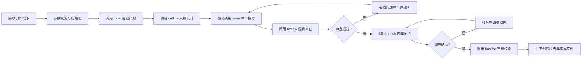

## 网文创作世界构建师 (worldbuilder)

### 触发关键词
我想写小说、写一本网文、从零开始创作小说、帮我写本XX类型的小说、我要写本小说、给我整个小说创作流程、自动写小说、小说创作一站式服务、帮我完成一本小说、我只有创意怎么写小说、从零开始写网文、小说全流程创作

### 核心功能
worldbuilder 是网文创作的一站式主控技能，负责统筹协调从创意萌芽到作品完稿的完整创作链路，构建完整统一的故事世界。通过智能编排各专项技能的调用顺序与参数传递，实现自动化、流水线式的网文创作体验：

1. **选题策划**：调用 `sumeru-topic` 进行市场分析、选题定位，生成核心创意与卖点
2. **大纲设计**：调用 `sumeru-outline` 构建完整世界观、人物设定、分卷大纲与章节规划
3. **内容创作**：调用 `sumeru-write` 按大纲进行分章节内容撰写，保持风格统一
4. **逻辑审查**：调用 `sumeru-review` 校验时间线一致性、人物行为逻辑、前后剧情连贯性
5. **内容润色**：调用 `sumeru-polish` 进行文笔优化、细节丰满、节奏调整
6. **完稿校验**：调用 `sumeru-finalize` 完成错别字检查、标点规范、逻辑漏洞最终排查与作品打包

### 执行流程


**详细流程说明**：
1. **初始化阶段**：验证输入参数有效性，创建工作目录，初始化创作状态
2. **需求收集阶段**：智能判断用户提供的信息是否充足，如信息不足则自动触发交互式提问引导用户补充需求，确认所有需求后进入下一阶段
3. **选题阶段**：基于收集到的完整需求生成3-5个精准匹配的选题方案供选择，确定后进入大纲设计
4. **大纲阶段**：先输出世界观与人设，确认后生成完整大纲
5. **创作阶段**：按章节顺序批量创作，每10章进行一次中期检查
6. **审查阶段**：自动检测时间线冲突、人物OOC、剧情矛盾等问题
7. **润色阶段**：提供多种润色风格选项（精简/详写/抒情/热血等）
8. **完稿阶段**：从 `chapters/` 目录读取最终章节，输出多种格式（Markdown/HTML/EPUB）到 `publish/` 目录，生成创作总结报告

### 交互式需求引导
当用户提供的信息过于简略时（仅输入题材和少量关键词），系统会自动触发交互式提问，一步步引导用户明确创作需求，确保生成内容完全符合预期。

#### 提问维度（按优先级）
##### 基础信息确认（必问）
1. 🎯 **题材确认**：确认具体题材细分类型，如"玄幻" → "高武玄幻/修仙玄幻/异世玄幻/系统玄幻"
2. 📏 **篇幅预期**：确认目标字数/章节数，是短篇/中篇/长篇/超长篇
3. 🎯 **核心爽点**：用户最看重的爽点类型，如"打脸/升级/搞钱/恋爱/权谋"
4. 👥 **受众定位**：目标读者群体，男频/女频/全年龄，偏向什么年龄层

##### 核心设定引导（可选，根据需求深度）
5. 🦸 **主角设定偏好**：主角性格（隐忍/张扬/腹黑/逗比）、身份（废柴/天才/穿越者/重生者）、金手指类型偏好
6. 🎭 **反派设定偏好**：反派类型（家族敌人/宗门对手/异族/天道）、反派强度
7. 🌍 **世界观偏好**：偏向什么世界观设定，是否有特别喜欢/讨厌的设定
8. 📖 **参考作品**：是否有类似风格的参考作品，可以更精准匹配风格

##### 风格偏好设置（可选）
9. ✍️ **写作风格**：偏好快节奏爽文/细腻精品文/幽默搞笑文/暗黑压抑文
10. 📱 **发布平台**：计划发布到哪个平台，适配对应平台的节奏和字数要求
11. ⚠️ **禁忌内容**：明确不想要的情节、设定、人物类型

#### 需求确认机制
- 所有用户回答自动保存到 `.sumeru/session/user-requirements.json`，全流程各阶段共享使用
- 提问完成后生成**需求确认摘要**，用户确认无误后才开始正式创作
- 支持中途修改，用户可以随时调整之前的回答

### 数据持久化规范
所有中间状态数据统一存储在当前工作目录的 `.sumeru/` 目录下，避免上下文压缩或清理导致数据丢失：

#### 数据生命周期管理
1. **自动保存**：每完成一个阶段自动将数据写入对应目录，支持幂等写入
2. **版本控制**：关键节点自动生成版本快照，命名格式 `{stage}-{timestamp}.json`
3. **断点恢复**：使用恢复功能时自动从 `.sumeru/` 目录读取对应阶段数据
4. **清理规则**：支持清理所有中间数据，默认保留最近3个版本
5. **数据复用**：可直接引用其他项目的 `.sumeru/` 目录数据，实现世界观/人设复用

**详细流程说明**：
1. **初始化阶段**：验证输入参数有效性，创建工作目录，初始化创作状态
2. **需求收集阶段**：智能判断用户提供的信息是否充足，如信息不足则自动触发交互式提问引导用户补充需求，确认所有需求后进入下一阶段
3. **选题阶段**：基于收集到的完整需求生成3-5个精准匹配的选题方案供选择，确定后进入大纲设计
4. **大纲阶段**：先输出世界观与人设，确认后生成完整大纲
5. **创作阶段**：按章节顺序批量创作，每10章进行一次中期检查
6. **审查阶段**：自动检测时间线冲突、人物OOC、剧情矛盾等问题
7. **润色阶段**：提供多种润色风格选项（精简/详写/抒情/热血等）
8. **完稿阶段**：从 `chapters/` 目录读取最终章节，输出多种格式（Markdown/HTML/EPUB）到 `publish/` 目录，生成创作总结报告

### 交互式需求引导
当用户提供的信息过于简略时（仅输入题材和少量关键词），系统会自动触发交互式提问，一步步引导用户明确创作需求，确保生成内容完全符合预期。

#### 提问维度（按优先级）
##### 基础信息确认（必问）
1. 🎯 **题材确认**：确认具体题材细分类型，如"玄幻" → "高武玄幻/修仙玄幻/异世玄幻/系统玄幻"
2. 📏 **篇幅预期**：确认目标字数/章节数，是短篇/中篇/长篇/超长篇
3. 🎯 **核心爽点**：用户最看重的爽点类型，如"打脸/升级/搞钱/恋爱/权谋"
4. 👥 **受众定位**：目标读者群体，男频/女频/全年龄，偏向什么年龄层

##### 核心设定引导（可选，根据需求深度）
5. 🦸 **主角设定偏好**：主角性格（隐忍/张扬/腹黑/逗比）、身份（废柴/天才/穿越者/重生者）、金手指类型偏好
6. 🎭 **反派设定偏好**：反派类型（家族敌人/宗门对手/异族/天道）、反派强度
7. 🌍 **世界观偏好**：偏向什么世界观设定，是否有特别喜欢/讨厌的设定
8. 📖 **参考作品**：是否有类似风格的参考作品，可以更精准匹配风格

##### 风格偏好设置（可选）
9. ✍️ **写作风格**：偏好快节奏爽文/细腻精品文/幽默搞笑文/暗黑压抑文
10. 📱 **发布平台**：计划发布到哪个平台，适配对应平台的节奏和字数要求
11. ⚠️ **禁忌内容**：明确不想要的情节、设定、人物类型

#### 交互模式参数
| 参数名 | 说明 |
|--------|------|
| `--interactive` | 强制开启全量交互式提问，即使用户提供了充足信息也会完整走一遍需求确认流程 |
| `--quick` | 快速模式，仅提问最核心的3个问题（题材确认、篇幅、核心爽点），其他使用默认值 |
| `--no-interactive` | 关闭交互式提问，直接基于已有信息生成，适合明确知道自己需求的用户 |

#### 需求确认机制
- 所有用户回答自动保存到 `.sumeru/session/user-requirements.json`，全流程各阶段共享使用
- 提问完成后生成**需求确认摘要**，用户确认无误后才开始正式创作
- 支持中途修改，用户可以随时调整之前的回答

#### 引导示例
```
> /worldbuilder 玄幻 "废柴逆袭"
🤖 我来帮您完善创作需求，只需要回答几个简单问题：
1️⃣ 请问您想要的玄幻细分类型是？[高武玄幻/修仙玄幻/异世玄幻/系统玄幻/其他]
> 系统玄幻
2️⃣ 预期总篇幅大概多少字？[20万内/20-50万/50-100万/100万以上]
> 100万以上
3️⃣ 您最看重的核心爽点是？[打脸/升级/扮猪吃虎/收小弟/开后宫/其他]
> 打脸+扮猪吃虎
4️⃣ 主角性格偏好？[隐忍腹黑/张扬霸道/逗比搞笑/温柔沉稳/其他]
> 隐忍腹黑
5️⃣ 有没有特别喜欢的参考作品？比如类似《XX》的风格
> 类似《大王饶命》的搞笑风格
...

✅ 需求收集完成，给您确认一下：
类型：系统玄幻
篇幅：100万字以上
核心爽点：打脸+扮猪吃虎
主角性格：隐忍腹黑
风格参考：《大王饶命》搞笑风
是否确认？[Y/n]
> Y
🚀 开始创作！
```

### 参数说明

| 参数名 | 类型 | 必填 | 默认值 | 说明 |
|--------|------|------|--------|------|
| `genre` | string | 是 | - | 作品类型，如：玄幻、都市、仙侠、科幻、言情、悬疑等 |
| `keywords` | string | 是 | - | 核心创意关键词，支持多个关键词用"+"连接，如："废柴逆袭+系统流+赘婿" |
| `--title` | string | 否 | 自动生成 | 指定作品标题，如不提供则自动生成 |
| `--length` | string | 否 | "medium" | 预期篇幅长度：short(20万字内)/medium(20-50万字)/long(50-100万字)/epic(100万字以上) |
| `--style` | string | 否 | "balanced" | 写作风格：fast(快节奏)/balanced(均衡)/detailed(详写)/literary(文艺) |
| `--tone` | string | 否 | "neutral" | 整体调性：humorous(幽默)/serious(严肃)/inspiring(励志)/dark(暗黑) |
| `--output-dir` | string | 否 | "./output" | 作品输出目录路径 |
| `--resume` | string | 否 | - | 中断恢复，传入上次的创作会话ID |
| `--skip-stages` | string | 否 | - | 跳过指定阶段，逗号分隔：topic,outline,write,review,polish,final |
| `--auto-confirm` | boolean | 否 | false | 是否自动确认所有中间步骤（无人值守模式） |

### 使用示例

#### 基础使用
```bash
# 最简单的调用方式，只指定类型和关键词
/worldbuilder 玄幻 "废柴逆袭+系统流"

# 都市言情作品，指定标题
/worldbuilder 言情 "霸道总裁+契约恋爱" --title "总裁的契约新娘"

# 科幻悬疑，长篇幅，快节奏风格
/worldbuilder 科幻 "时间循环+密室解谜" --length epic --style fast
```

#### 进阶使用
```bash
# 指定详细参数的完整调用
/worldbuilder 仙侠 "重生+无敌流+宗门" \
    --title "重生之太上掌门" \
    --length long \
    --style detailed \
    --tone inspiring \
    --output-dir "./my-novels/taishang" \
    --auto-confirm false

# 从中断点恢复创作
/worldbuilder 玄幻 "废柴逆袭+系统流" --resume "session-20240315-abc123"

# 跳过选题阶段，直接从已有大纲继续创作
/worldbuilder 都市 "职场+重生" --skip-stages topic
```

#### 多风格组合
```bash
# 幽默风都市修仙
/worldbuilder 都市 "修仙+打工+搞笑" --style balanced --tone humorous

# 暗黑系悬疑推理
/worldbuilder 悬疑 "连环杀人+心理侧写+反转" --style detailed --tone dark

# 热血励志竞技
/worldbuilder 竞技 "篮球+天赋+逆袭" --style fast --tone inspiring
```

### 错误处理说明

#### 常见错误类型与解决方案

| 错误代码 | 错误信息 | 原因分析 | 解决方案 |
|----------|----------|----------|----------|
| `INVALID_GENRE` | 不支持的作品类型 | 传入的 genre 参数不在支持列表中 | 检查类型拼写，支持的类型：玄幻、都市、仙侠、科幻、言情、悬疑、历史、游戏、竞技、军事、武侠、轻小说 |
| `KEYWORDS_TOO_LONG` | 关键词过长 | keywords 参数超过100字符限制 | 精简关键词，保留最核心的3-5个 |
| `DEPENDENCY_MISSING` | 缺少依赖技能 | 未安装所需的子技能（topic等） | 运行 `/find-skills ` 查找并安装所有依赖技能 |
| `OUTPUT_DIR_PERMISSION` | 输出目录无权限 | 指定的 output-dir 无写入权限 | 更换有权限的目录，或使用默认目录 |
| `INVALID_SESSION_ID` | 无效的会话ID | resume 参数传入的会话ID不存在 | 检查会话ID是否正确，或重新开始创作 |
| `STAGE_SKIP_CONFLICT` | 阶段跳过冲突 | 跳过的阶段与后续阶段有依赖关系 | 移除对前置阶段的跳过，或提供必要的前置文件 |
| `CONTENT_GENERATION_FAILED` | 内容生成失败 | 创作过程中遇到内容审核或模型限制 | 调整关键词或风格参数，或分阶段手动确认 |

#### 错误恢复机制
- **自动重试**：对于临时性网络错误，自动重试3次，间隔5秒
- **断点保存**：每完成一个阶段自动保存状态，支持从中断点恢复
- **回滚选项**：对不满意的阶段可选择回滚到上一节点重新开始
- **错误报告**：生成详细的错误日志文件，位于 `{output-dir}/error.log`

### 进阶使用场景

#### 场景1：团队协作创作
```bash
# 策划完成选题和大纲后，交由写手继续
/worldbuilder 玄幻 "废柴逆袭+系统流" --skip-stages write,review,polish,final

# 写手接手，从创作阶段继续
/worldbuilder 玄幻 "废柴逆袭+系统流" --skip-stages topic,outline --resume "session-xxx"
```

#### 场景2：多版本对比创作
```bash
# 生成多个版本进行对比
/worldbuilder 言情 "穿越+宫斗" --title "清宫·甄嬛传" --style literary
/worldbuilder 言情 "穿越+宫斗" --title "清宫·步步惊心" --style fast
```

#### 场景3：定制化系列作品
```bash
# 第一部
/worldbuilder 玄幻 "系统+升级" --title "武帝降临" --length medium

# 第二部（沿用世界观）
/worldbuilder 玄幻 "系统+升级" --skip-stages topic,outline --resume "session-wudi1" --title "武帝降临2"
```

#### 场景4：A/B测试优化
```bash
# 测试不同开篇风格
/worldbuilder 都市 "重生+商战" --skip-stages write,review,polish,final
# 手动修改大纲中的开篇设定后继续
/worldbuilder 都市 "重生+商战" --skip-stages topic --resume "session-xxx"
```

#### 场景5：批量生成素材库
```bash
# 生成多个选题方案用于后续选择
/worldbuilder 玄幻 "废柴" --skip-stages outline,write,review,polish,final
/worldbuilder 玄幻 "系统" --skip-stages outline,write,review,polish,final
/worldbuilder 玄幻 "重生" --skip-stages outline,write,review,polish,final
```

#### 数据持久化规范
所有中间状态数据统一存储在当前工作目录的 `.sumeru/` 目录下，避免上下文压缩或清理导致数据丢失：

#### 全局存储结构
```
.sumeru/
├── session/          # 会话全局数据
│   ├── config.json   # 创作配置参数
│   ├── status.json   # 当前进度状态
│   └── history.log   # 操作历史记录
├── topic/            # 选题阶段输出
│   ├── report.md     # 完整选题策划报告
│   └── options.json  # 多选题方案原始数据
├── outline/          # 大纲阶段输出
│   ├── world.md      # 世界观设定
│   ├── characters.json # 人物设定卡
│   ├── plot.md       # 剧情大纲
│   └── chapters.json # 章节细纲
├── write/            # 创作阶段输出
│   ├── draft/        # 章节草稿
│   └── progress.json # 创作进度跟踪
├── review/           # 审查阶段输出
│   ├── timeline.json # 时间线数据
│   ├── issues.json   # 问题清单
│   └── plot-map.json # 剧情脉络图
├── polish/           # 润色阶段输出
│   ├── modified/     # 润色后版本
│   └── diff.json     # 修改对比记录
└── finalize/         # 完稿阶段输出
    ├── clean/        # 纯净版全文
    ├── platforms/    # 各平台导出版本
    └── report.md     # 完稿校验报告
```

#### 数据生命周期管理
1. **自动保存**：每完成一个阶段自动将数据写入对应目录，支持幂等写入
2. **版本控制**：关键节点自动生成版本快照，命名格式 `{stage}-{timestamp}.json`
3. **断点恢复**：使用 `--resume` 参数时自动从 `.sumeru/` 目录读取对应阶段数据
4. **清理规则**：支持 `--clean` 参数清理所有中间数据，默认保留最近3个版本
5. **数据复用**：可直接引用其他项目的 `.sumeru/` 目录数据，实现世界观/人设复用

### 高级配置：自定义阶段钩子
通过配置文件 `{output-dir}/hooks.json` 可以在各阶段前后插入自定义处理：
```json
{
  "before_topic": "my-preprocess-script.sh",
  "after_outline": "validate-outline.js",
  "before_write": "setup-write-env.py",
  "after_final": "deploy-to-platform.sh"
}
```
