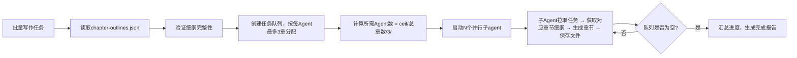

## 网文章节撰写

### 触发关键词
帮我写一章小说、续写接下来的内容、生成XX情节、批量写网文章节、扩写/重写这段内容、帮我写个XX情节、续写小说、把这段内容扩写、重写这一章、批量生成小说章节、写个开篇章节、写个高潮情节、小说内容生成、帮我写小说内容、网文章节生成、从细纲生成章节、按细纲写小说、批量生成所有章节、细纲驱动写作

### 核心功能
1. **基于完整细纲生成**：自动读取 `.sumeru/outline/chapter-outlines.json`，根据细纲批量生成章节
2. **智能细纲匹配**：支持按章节号、卷号、或全部章节进行生成
3. 基于大纲和细纲生成完整章节内容
4. 自动适配网文节奏：开头抓眼球、中间有冲突、结尾留悬念
5. 保持人物性格、剧情逻辑的一致性
6. 支持自定义章节长度（默认4000-5000字/章）
7. 支持续写、修改、调整已有章节内容

### 续写规则

#### 续写模式
支持续写、重写、扩写、精简等多种模式

#### 续写注意事项
1. 保持人物性格一致性，不OOC（Out Of Character）
2. 保持前文设定的战力体系、世界观不崩坏
3. 伏笔回收要自然，不突兀
4. 语言风格与前文保持统一
5. 承接上文剧情，开启下文伏笔
6. 如已有章节内容不完整，优先补完

#### 多章生成
支持连续生成多章内容，自动按章节顺序生成

### 细纲驱动批量生成

#### 自动读取细纲模式
当 `.sumeru/outline/chapter-outlines.json` 存在时，自动启用细纲驱动模式：

```bash
# 生成所有章节（读取细纲，自动并行）
/sumeru-write --all

# 生成指定范围章节
/sumeru-write 第1-50章

# 生成特定卷的所有章节
/sumeru-write --volume 1

# 生成特定章节
/sumeru-write 第3章,第5章,第10章

# 指定并行度生成
/sumeru-write --all --parallel 5
```

#### 细纲输入格式支持

支持直接传入单章细纲：

```bash
# 使用JSON格式细纲生成单章
/sumeru-write 第3章 --outline '{"chapterTitle":"...","coreEvent":"..."}'

# 从文件读取细纲
/sumeru-write 第3章 --outline-file ./custom-outline-3.json
```

#### 细纲数据结构验证

生成前自动验证细纲完整性：
- 检查必填字段是否存在
- 验证人物名称是否在characters.json中定义
- 检查场景地点是否在world.json中定义
- 提供缺失信息的补充建议

#### 子agent并行批量写作（大量章节推荐）
当需要一次性生成大量章节（>3章）或使用细纲驱动模式时，自动启用子agent模式：

**⚠️ 遵循全局约束：每个子Agent最多负责3个章节**（详见 AGENTS.md "子Agent并行处理规则"）
- 所需Agent数 = ceil(总章节数 / 3)，调度器自动计算
- 相邻章节分配给同一Agent，保持上下文连贯性

**核心优势**
- ✅ **细纲隔离**：每个子agent只获取自己负责章节的细纲，避免上下文溢出
- ✅ **3章上限保障**：每个Agent最多3章，确保生成质量和一致性
- ✅ 上下文隔离：每个子agent不携带历史章节内容，彻底解决长上下文压缩/溢出问题
- ✅ 速度提升：多并行写作，速度是串行的N倍
- ✅ 错误隔离：单章生成失败不影响其他章节，自动重试失败章节
- ✅ 内存优化：子agent完成后自动销毁，释放内存资源
- ✅ 增量写入：每写完一章立即保存到`.sumeru/write/draft/`，无需等待全部完成
- ✅ **进度可视化**：实时显示已完成/进行中/待写章节状态

**调度逻辑（细纲驱动）**


**章节分配规则**
- 按章节顺序连续分配，如Agent1负责第1-3章，Agent2负责第4-6章，以此类推
- 尾部不足3章的Agent按实际剩余章节数分配
- 相邻章节分配给同一Agent，以保持上下文连贯性

**子agent输入上下文**
- 完整章节内容，符合指定风格与节奏
- 下一章内容预告/思路建议
- 本章剧情关键点梳理
- 本章埋设的伏笔提示（可选）
- 人物成长/变化摘要（可选）

### 数据持久化
#### 正式输出（用户可见）
- 生成的章节默认保存到当前工作目录的 `chapters/` 下，命名格式：`第{num}章_{标题}.md` 或 `chapter-{num}.md`
- 章节文件为纯净的正文内容，不含任何中间标记和元数据，用户可直接阅读、编辑
- 支持自定义章节输出目录
- **批量生成进度报告**：`chapters/WRITE_PROGRESS.md`（实时更新）

#### 中间过程数据（仅系统内部使用）
所有中间状态、元数据、进度信息统一保存到 `.sumeru/write/` 目录：
- `progress.json`：创作进度跟踪，包含已完成章节、字数统计、各章节状态
- `chapter-meta.json`：每章元数据，包含核心事件、出场人物、爽点位置、伏笔记录
- `character-state.json`：人物状态动态跟踪，记录各时间点人物能力、关系、状态变化
- `used-outlines.json`：已使用的章节细纲记录，支持增量生成
- `original/`：原始章节文件备份目录。当 review 或 polish 使用 `--apply` 参数时，原始章节文件会先备份到 `.sumeru/write/original/` 目录，确保可回滚

#### 与其他 Skill 配合
- **前置 Skill**：自动读取 `.sumeru/outline/` 目录的大纲数据
  - 使用 `characters.json` 保持人物性格一致性
  - 使用 `chapter-outlines.json` 中的**完整章节细纲**驱动批量生成
  - 使用 `world.json` 保持世界观设定一致性
- **后续 Skill**：生成的章节数据可供 `sumeru-review`、`sumeru-polish`、`sumeru-finalize` 使用

#### 断点恢复
- 每次任务启动时读取 `chapters/` 目录下已存在的章节文件和 `.sumeru/write/progress.json` 进度
- 读取 `.sumeru/outline/chapter-outlines.json` 获取完整细纲
- 从最新未完成章节继续，自动跳过已生成的章节
- 支持从指定章节恢复创作
- 支持只生成缺失的章节（增量模式）
