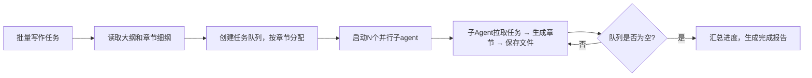

## 网文章节撰写

### 触发关键词
帮我写一章小说、续写接下来的内容、生成XX情节、批量写网文章节、扩写/重写这段内容、帮我写个XX情节、续写小说、把这段内容扩写、重写这一章、批量生成小说章节、写个开篇章节、写个高潮情节、小说内容生成、帮我写小说内容、网文章节生成

### 核心功能
1. 基于大纲和细纲生成完整章节内容
2. 自动适配网文节奏：开头抓眼球、中间有冲突、结尾留悬念
3. 保持人物性格、剧情逻辑的一致性
4. 支持自定义章节长度（默认2000-3000字/章）
5. 支持续写、修改、调整已有章节内容

### 续写规则

#### 续写模式
支持续写、重写、扩写、精简等多种模式

#### 续写注意事项
1. 保持人物性格一致性，不OOC（Out Of Character）
2. 保持前文设定的战力体系、世界观不崩坏
3. 伏笔回收要自然，不突兀
4. 语言风格与前文保持统一
5. 承接上文剧情，开启下文伏笔
6. 如已有章节内容不完整，优先补完

#### 多章生成
支持连续生成多章内容，自动按章节顺序生成

#### 子agent并行批量写作（大量章节推荐）
当需要一次性生成大量章节（>10章）时，自动启用子agent模式，每个章节由独立子agent完成，完全上下文隔离，避免上下文溢出和token浪费：

**核心优势**
- ✅ 上下文隔离：每个子agent不携带历史章节内容，彻底解决长上下文压缩/溢出问题
- ✅ 速度提升：多并行写作，速度是串行的N倍
- ✅ 错误隔离：单章生成失败不影响其他章节，自动重试失败章节
- ✅ 内存优化：子agent完成后自动销毁，释放内存资源
- ✅ 增量写入：每写完一章立即保存到`.sumeru/write/draft/`，无需等待全部完成

**调度逻辑**

### 输出内容
- 完整章节内容，符合指定风格与节奏
- 下一章内容预告/思路建议
- 本章剧情关键点梳理
- 本章埋设的伏笔提示（可选）
- 人物成长/变化摘要（可选）

### 数据持久化
#### 正式输出（用户可见）
- 生成的章节默认保存到当前工作目录的 `chapters/` 下，命名格式：`第{num}章_{标题}.md` 或 `chapter-{num}.md`
- 章节文件为纯净的正文内容，不含任何中间标记和元数据，用户可直接阅读、编辑
- 支持自定义章节输出目录

#### 中间过程数据（系统内部使用，不展示给用户）
所有中间状态、元数据、进度信息统一保存到 `.sumeru/write/` 目录：
- `progress.json`：创作进度跟踪，包含已完成章节、字数统计、各章节状态
- `chapter-meta.json`：每章元数据，包含核心事件、出场人物、爽点位置、伏笔记录
- `character-state.json`：人物状态动态跟踪，记录各时间点人物能力、关系、状态变化
- `auto-save/`：自动快照目录，每完成1章自动保存版本，防止内容丢失
- `agent-logs/`：子agent运行日志和临时缓存

#### 断点恢复
- 中断后重新调用会自动读取 `chapters/` 目录下已存在的章节文件和 `.sumeru/write/progress.json` 进度
- 从最新未完成章节继续，自动跳过已生成的章节
- 支持从指定章节恢复创作
- 可读取 `.sumeru/outline/` 目录的大纲数据自动填充章节参数
- 续写时自动读取前文人物状态、剧情脉络，保持一致性
